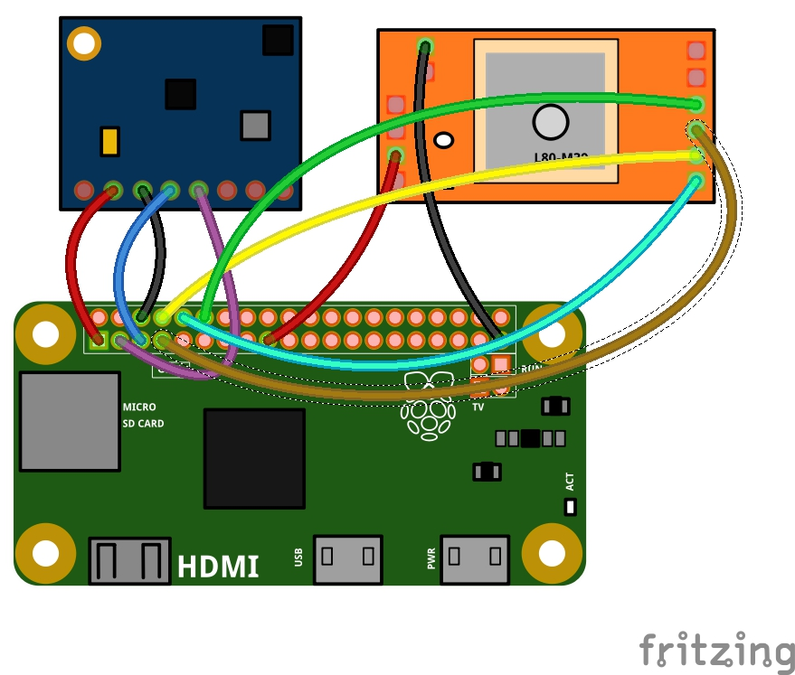

#BOM
##Hardware

1) Raspberry Pi Zero

2) Microstack GPS module

3) Adafruit combined LSM303/BMP085 accelerometer/altimeter

4) Power bank/battery pack

5) Sponge ball

(prototype)

6) Breadboard and wires

## Software

1) [Microstacknode IOT Python3 library](https://github.com/microstack-IoT/python3-microstacknode)

2) Adafruit LSM303 Python library, modified for Python3 (version in thsi GitHub repo)

3) Adafruit BMP085 Python libarary, modified for Python3 (version in thsi GitHub repo)

4) Latest version of Raspbian (Jessie) 